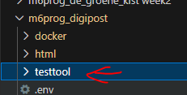

## html formulier

- lees:
```

we werken nu met GET requests, maar straks ook met PUT, POST en DELETE
- dat is lastig te testen met de browsers
- tenzij wij daar een tool voor maken

- deze tool maken we even BUITEN onze website

```

## opzet

- maak een nieuwe directory:
    > 
- maak daar een nieuwe file aan:
    - apitest.html
        - zet daar de standaard html in

## formulier

- wij hebben het volgende nodig, maak dat in een html formulier
    ```
    - een url (waar we heen posten)
    - een dropdown met de methode (GET,PUT,POST,DELETE)
    - een textveld voor de auth token (hebben we later nodig)
    - een textveld voor een userid (hebben we later nodig)
    - een veld om een grotere text in te kunnen zetten
    - een button om te submitten
    ```

- maak ook een tag nodig (buiten het formulier) om de response /json weer te geven
    - gebruik een pre tag


## 
