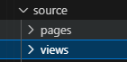
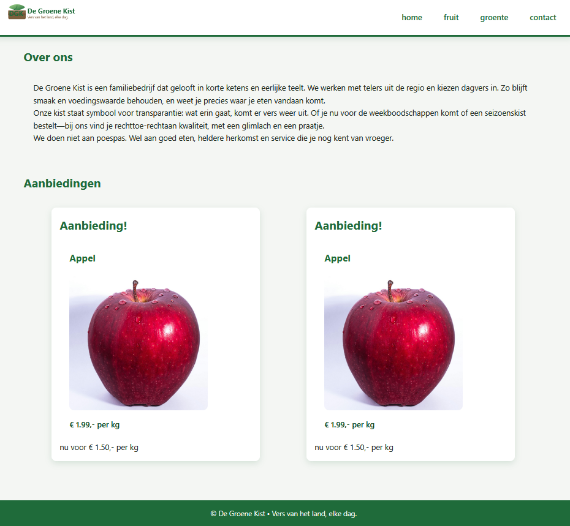

## files

- maak een index.php en zorg dat je een navigatie en footer hebt. 
- zorg dat je de verschillende herhalende elementen in aparte files zet
- de verwachting is dat views ergens onder source staan en niet in public

## de groente boer

- lees:
    ```
    we maken even een website voor de groente boer. 

    wat je klant wil:
    - is een intro pagina met aanbiedingen en een over ons tekst
    - een producten pagina voor groente en fruit.
    - een contact pagina
    ```

- maak nu views voor de pagina's zoals hierboven beschreven staat. 
    - design en maak de HTML, we hebben nog geen content, gebruik teksten zoals in het voorbeeld helemaal onderaan
        > probeer views en pagina's uit elkaar te houden. zet ze in source.  
        > 

## Maak je winkel
- gebruik nu AI om:
    - een winkelnaam en logo te maken
    - een nep locatie en route beschrijving te maken
    - een over ons text te maken
    
    - een een stijl te maken voor de groente boer
        - maak alvast class names, open je site in je browser en kopieer de html naar de html
            > ZO sturen we de AI en houden we de controle en de kennis
            >


## samenvoegen

- voeg nu alles samen en test!
- voorbeeld:
    >


## controle

- check of je project NETJES georganiseerd is
- laat je site bij de leraar zien om te controlleren en af te tekenen
    > je moet je setup kunnen uitleggen

## commit

- commit & push!
