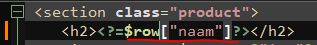
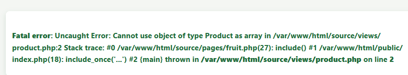
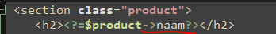

## Product gebruiken

- lees:
    ```
    ik neem aan dat je iets van een Product tabel hebt voor je groente en fruit
    ```

- open je fruit pagina
    - controlleer of je daar data uit de database haalt
        >
    - en of je ongeveer zo de data op het scherm zet:
        >

## GOED LEZEN


- lees:
    ```
    we gaan nu stapje voor stapje dingen naar de dataclass verhuizen
    - onze query
    - hoe we een row uit de database naar een product omzetten
        - waar we ook de constructor gebruiken
    - en onze database code uit de views halen en naar de dataclasses zetten

    - het doel is dat de VIEW alleen de DATACLASS gebruikt en niets van SQL weet
    ```

## STAP 1

>  HINT: jou classes heten misschien NET iets anders dan die van mij, pas dan mijn code aan! (Begrijp wat JIJ gemaakt hebt)

- open je fruit view/pagina
    - voeg een nieuwe variabel en een NEW toe achter de is: 
        >
    - de constructor is nog leeg, vul die ik heb dit:
        >

## constructor begrijpen:

- kijk naar het plaatje van mijn constructor voor product en bedenk hoe dit werkt
    
    >

- lees en begrijp:
    ```
    - we halen voor ELK argument in de constructor de data uit de rij op
    - deze zetten we in de juiste volgorde tussen de haakjes van de constructor
    - we bewaren dit in $product 
        - deze gebruiken we later in de VIEW
    ```

## view aanpassen

- probeer je pagina, als het goed is krijg je een error in de view:
    >

- open je view en pas je view aan, bijvoorbeeld om nu de naam te pakken:
    - wordt:
        >
    - nu dit:
        >

- pas alles aan en zorg dat het werkt!
    > LET OP: je JOINS gaan nu kapot , dat is ok, dat maken we later

## controlleren

- check met de docent je werk
- commit & push!