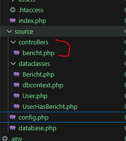
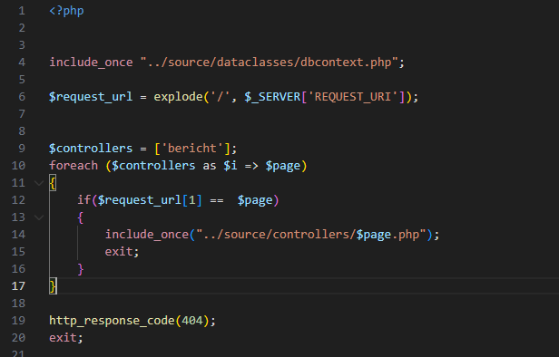

## api routing


- lees:
```

- voor ons project gaan we een REST api bouwen. vaak zie je de urls zo:
    - https://digipost.nl/berichten/ => haalt alle berichten op
    - https://digipost.nl/berichten/10 => haalt bericht met id 1 op

- wij moeten wel iets strakker erin gaan zitten, want we mogen niet alle berichten zomaar tonen!
    - wij moeten authorisatie controlleren 
```

## onderzoek het voorbeeld
- kijk naar de pokeapi
    - https://pokeapi.co/

    - zie je hoe die het doen?

## index.php

- lees:
    ```
    - voor nu gaan we index.php onze api magie laten doen. 
    - we gaan controllers maken die de dataclasses gebruiken en van het resultaat json maken
    - index gaat naar de url kijken en om te bepalen waar we heen moeten (controller) en welke function we moeten hebben (get,post,put delete)

    ```

- laten we beginnen, maak een map controllers onder source aan
    - maak een bericht.php
        > 

- open nu je index.php en zet dit erin:
    > 

- lees:
    ```
    we moeten even begrijpen wat we hier doen. Dit is een beetje zoals de music library, alleen we hebben geen html (want API)
    - we hebben altijd onze dbcontext nodig dat is al onze database code
    - we kijken naar de url
    - we controlleren dan of de url die opgevraagd wordt wel volgens ons bestaat
    - JA? dan includen we de controller
    - NEE? dan geven we een NOT FOUND 404 terug
    ```

- in controllers/bericht.php zet even een echo voor nu om te testen:
    > 

    
## controlleren

- check met de docent


## klaar?

- commit & push!