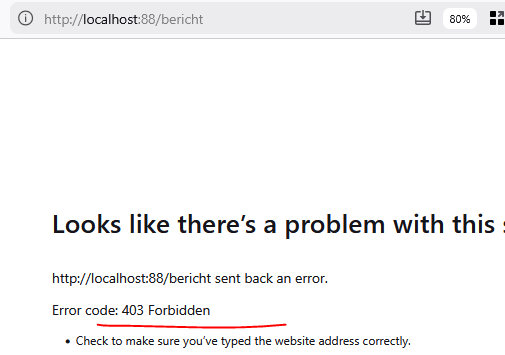

## GET POST etc

- in onze controllers moeten we kijken naar de HTTP method, bekijk dit plaatje en url:
    - https://www.php.net/manual/en/reserved.variables.server.php
        > 

- zo kunnen we kijken welke method de httprequest gebruikt! maak nu:
    - in de bericht controller een if die test of je een GET hebt
    - als dat waar is zet de response code even op 403
        > 

## Oefenen

- maak nu als je een GET krijgt voor berichten dat je json terugkrijgt:
    > 

    > HINTS: 
    > - Content-Type header is nodig
    > - zoek het MIME type voor json
    > - json encoding van je dataclass[] naar een json string

## by id

- maak nu ook een ingang voor 1 bericht ophalen by id:
    > 
    
    > HINTS:
    > - maak gebruik van een GetBerichtById function in je dataclass
    > - je url moet er ongeveer zo uitzien: `http://localhost:88/bericht/5`
    > - je parsed al de url, in welk deel zit de id?

## Refactor

- je hebt waarschijnlijk nu 1 lap code. maak voor je GET path een aparte function:
    - handleGet

## controlleren

- check met de docent

## klaar?

- commit & push!