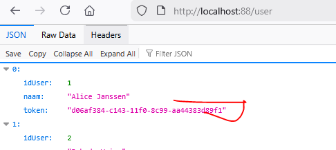
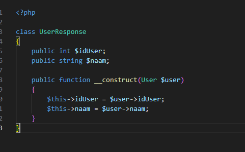

## user name opvragen

- we willen ook een user kunnen opvragen maak:
    - de controller
    - de getall route
    - de byid route

- test het
    - heb jij ook een wachtwoord lek?:
        > 

## lek dichten

- lees:
    ```
    - hoe dichten we dit lek? de oorzaak is we selecteren alles... maar dat hebben we straks wel nodig voor de authentication.

    - een optie is om een extra class te maken:  UserResponse, die lijkt op User maar zonder de database functionaliteit, en heeft een constructor waar een user in gaat
    - een andere is om data leeg te halen: zet token op null of een lege string
    ```

- een Response class is netter. die gaan we maken, deze heeft wel de id en de naam, maar meer niet
    - bouw die class, onder controllers/models
        > 
- gebruik die nu op de byid route
    > 

## GetAll

- doe hetzelfde voor getall, deze is wat meer werk 2 opties:
    - gebruik een for loop
    - gebruik een array_map *(als je de code niet begrijpt zoek uit OF gebruik een for)*
        > 

- controlleer:
    > 

## controlleren

- check met de docent


## klaar?

- commit & push!