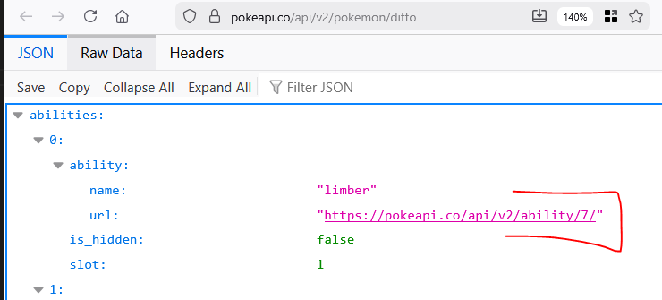

## Doorlinken

- lees:
```
- tegenwoordig krijg je vaak links naar andere objecten in een api mee zie het plaatje hieronder
- dat willen wij ook met onze users doen
```
> 

## helper function

- lees:
    ```
    - om urls te maken moeten we weten wat onze url is, op welke server dan ook 
    ```
- open index.php
    - voeg deze php function toe:
        ```php
        function GetApiPath()
        {
            
            $domain = $_SERVER['HTTP_HOST'];
            $scheme = (!empty($_SERVER['HTTPS']) && $_SERVER['HTTPS'] !== 'off') ? "https" : "http";
            $basePath = dirname($_SERVER['SCRIPT_NAME']);

            $apiBaseUrl = $scheme . "://" . $domain . $basePath;
            return $apiBaseUrl;
        }
        ```

## BerichtResponse

- de dataclasses blijven we af, en bouwen we geen extra url in, dus maak een BerichtResponse class:
    - in model
    - net als de UserResponse
    - alleen maak een url ipv de userid, gebruik de helper function


## controlleren

- je zou nu dit moeten krijgen:
    > 

- check met de docent of alles klopt


## klaar?

- commit & push!