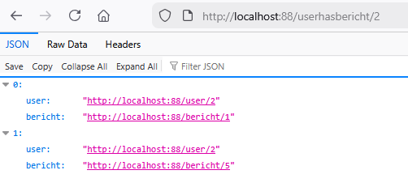
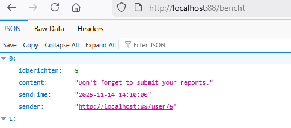

## user heeft berichten

- als het goed is heb je een many-to-many voor user en bericht maak daar nu het volgende voor:
    - een api route voor alles (om te testen)
        - zorg voor doorclick urls!
        > 
    - een api route om de berichten voor 1 userid op te halen
        > `http://localhost:88/userhasbericht/1`
        > 


## controlleren

- je zou nu dit moeten krijgen:
    > 


## Berichtenbox

- lees:
    ```
    - leest dit makkelijk? en is dit handig met die urls? denk daar even over na
    - wat zijn de voordelen?
    - wat zijn de nadelen
    ```

- we maken een extra controller wat de berichten meteen weergeeft:
    - berichtenbox
    - deze werkt hetzelfde als `http://localhost:88/userhasbericht/1` 
        - je hoeft geen GetAll route te maken
    - maar geeft alle data weer als 1 ding, maak een aparte Response class

## controlleren

- dit is wat je ongeveer moet krijgen:
    > 

- check met de docent of alles klopt
    
## klaar?

- commit & push!