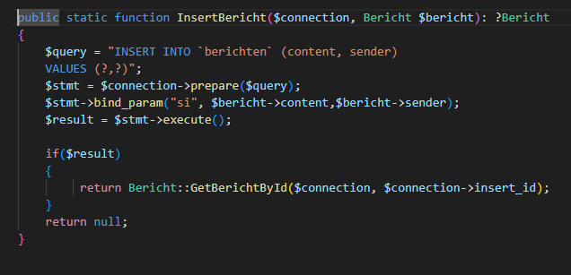

## PUT

- lees:
    ```
        - met een PUT request mogen wij iets INSERTEN
    ```

## dataclass uibreiden

- open je dataclass voor bericht
    - maak een nieuwe static functie FromJson:
        > 

    - lees:
        ```
        - waarom laat ik de id op -1 staan?
            - deze wordt door de database gevuld
        - en de datum leeg?
            - ik heb in mijn SQL van de tabel gezet dat de datum ook automatisch gevuld moet worden
                - heb jij dat niet? dan moet je de datum met php invullen, of je tabel aanpassen
        ```

    - maak een nieuwe static function InsertBericht:
        > 


## controller

- ga naar je bericht controller
    - maak een nieuwe function handlePut
        - die gebruik je als de request een PUT is
- in de function handlePut:
    - haal je json op met 
        ```php        
        $data =  file_get_contents('php://input') ; 
        ```
    - gebruik FromJson en InsertBericht om het bericht te inserten
        > 
    - echo daarna het nieuwe bericht terug als json
        > 
    
## testen

- test met de tool en dit bericht:
    ```json
    {"content":"Delivery confirmed for client order.","sender":1}
    ```

    
## controlleren

- je zou nu dit moeten krijgen:
    > 

- check met de docent of alles klopt


## klaar?

- commit & push!