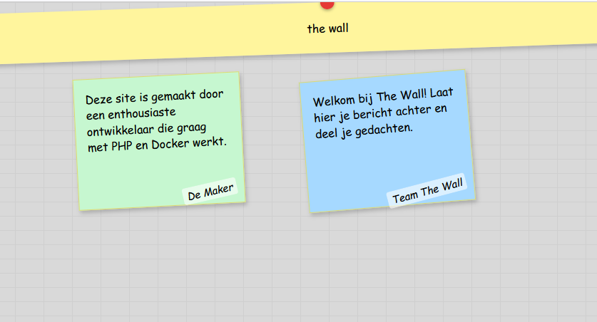

## data

- tijd om je data op het scherm te zetten maak het aan de hand van de volgende regels:
    ```
    - gebruik dataclasses
    - gebruik een view voor je message
    ```

- voorbeeld:
    > 

    
## testen

- controlleer het, en check met de docent of je project goed is


## klaar?

- commit & push!