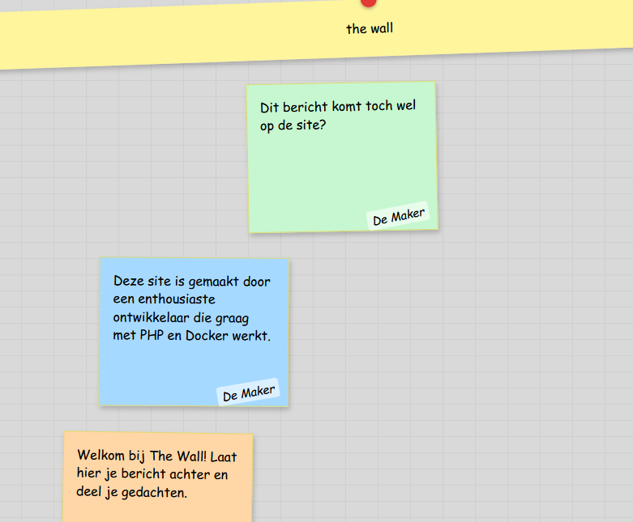

## controller

- maak een controller map onder source, en een postmessage controller php

- in je index.php:
    - test of je een POST bent
    - doe dit VOOR je data ophaalt
    - include dan je postmessagecontroller
    - maak een nieuwe controller aan met ```$ctrl = new ...()```

## controller invullen

- maak in de controller een nieuwe function:
    - handlePost

- in de function maak je het volgende:
```
- je haalt uit $_POST de variabelen die je met het formulier gepost had
    - daarmee maak je een `new` bericht (de dataclass)
- je gebruikt de dataclass van je bericht om een Insert te doen
    - de insert moet je misschien nog maken
```

## Testen

- zorg dat je kan posten:

    > 

## klaar?

- commit & push!
