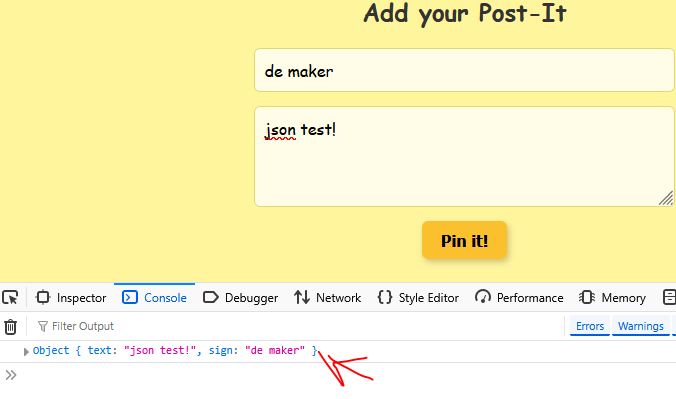
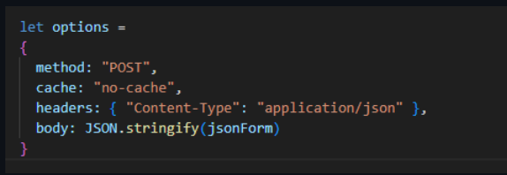
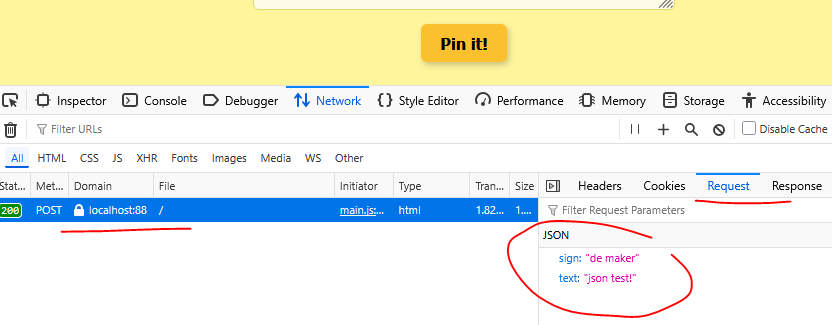

## main.js

- maak (als je die niet hebt) onder assets/js een main.js aan
    - koppel een event listener aan je formulier voor `submit`
        - zet in de function/lambda daar van:
            ```js
            event.preventDefault
            ```

## test

- test of je formulier nog werkt, deze zou NIET meer moeten posten 

## json maken

- wij willen de volgende json, maak dat door alles uit het formulier te halen:
    ```json
    {
        "text": "json test!",
    "sign": "de maker"
    }
    ```
- log daarna je json:
    >


## fetch

- tijd voor fetch, gebruik de fetch api om je json op te sturen, je hebt ook options nodig:
    
    >

##  Testen

- probeer het uit, controlleer met de network debugger
    >

- kijk wat je terugkrijgt als response.
    - dat zou je hele html moeten zijn

- herhaald je pagina, als het goed is komt er niets bij
    > je php is nog niet aangepast

    
## klaar?

- commit & push!
