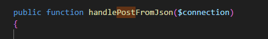
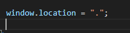

## controller

- open je postmessage controller
    - maak er een function bij
        >

## Lees je json

- maak nu de function zo dat:
    ```
    - je het json object maakt uit de string van file_get_contents('php://input') 
    - lees je text en je naam
    - insert het weer in de database
    ```

- verander je index zodat die de nieuwe function gebruikt

## Test

- post een message  
    - komt deze in de database?
    - komt deze op de pagina na een reload?

## refresh

- lees:
    ```
    nu moet je je pagina refreshen, dat is niet handig.
    we kunnen dat nu even met javascript oplossen. later maken we het mooier.
    ```
- aan het eind van je response van je fetch:
    >


## klaar?

- controlleer het met de docent
- commit & push!
