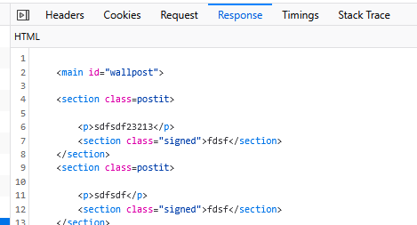
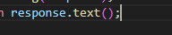

## delen updaten

- lees:
    ```
    als we op deze manier posten willen we een deel van de site ophalen
    - niet de hele site
    - en dat dan op de juiste plek in de DOM vervangen

    - wij gaan dat nu maken
    ```

## dynamische content

- zoek je dynamische content. Dat zou je messages/postits moeten zijn
    - bouw daar een main of section met een id omheen

- verhuis de main/section naar een php view, bv `wall.php`
    - zorg ook dat je in de VIEW de data ophaalt
    - include je view in je index.php 

## POST

- in je stukje wat over POST gaat (in je index.php als het goed is):
    - include je nu je view
    - dan doe je exit
- controlleer of je nu alleen die subview terugkrijgt bij een POST:
    >

## javascript

- maak het volgende:
    ```
    - in je fetch:
        - krijg je een response
        - daar kan je de text van krijgen (zie plaatje 1) 
        - dat is je subview HTML, zet die op je outerHTML van je main/section
    ```
> 

## TESTEN

- nu zou je website moeten posten, en de html moeten aanpassen!

## klaar?

- controlleer het met de docent
- commit & push!
