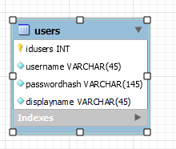
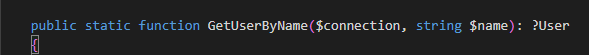

## database design

- maak dit ERD na:
    >
- sla je ERD op
- maak er sql van en zet die in de automatische uitrol

## data

- maak een 01 data.sql
    - zet deze test user er in:
        ```SQL
        -- wachtwoord helloworld
        INSERT INTO users (username,displayname,passwordhash)     values ('leraar','mario',    '$argon2id$v=19$m=65536,t=4,p=1$Zm9Cc0IwQ3BDLzRSaVIvYw$attCFRn94QfWxMObfoDrLtZ7emSPJjFl+AsqHGuQGAo');

        ```

## compose

- test of je database online komt

## dataclasses

- maak je dbcontext + user dataclass
    - zorg voor een function op user:
        >


## klaar?

- commit & push!