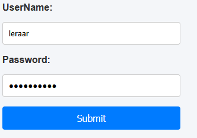
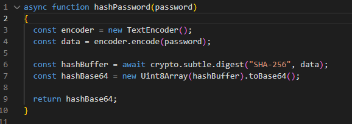

## database design

- maak in index.php input (zonder een form):
    ```
    - waar je een username kan invoeren
    - waar je een password kan invoeren
    - met een knop die onclick de function login() aanroept
    - een  <section> waar je het resultaat in kan zetten later
    ```

- voorbeeld:
    > 

## JS
- maak een main.js script
    - maak daar de login function aan (laat nog leeg!)
- zet daar ook deze function in:
    > 

## Login function

- maak het volgende in de login function:
    ```
    - haal je user & password uit je elementen
    - maak een fetch naar login.php
    - de fetch moet een json POSTEN naar login.php
    - het json bericht heeft de user
        - en het gehashde wachtwoord (gebruik de extra function)
    - zet de TEXT uit de response in de result section
    ```

## testen

- test of je form alles goed verstuurd, gebruik de test login en je krijg:
    > 

## klaar?

- commit & push!