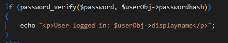
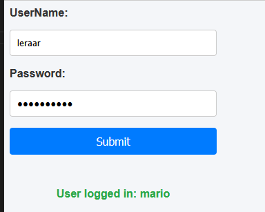
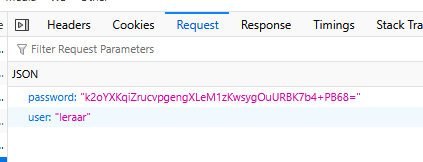

## database design

- maak open login.php

    - kijk naar dit plaatje:
        > 
    
    - maak het volgende in login.php:
        ```
        - gooi een 500 response code als het geen POST is
        - als het een post is:
            - haal je json op uit php://input
            - decode je json

            - haal je User op met GetUserByName

            - check of je user bestond
                - ZO NIET?  
                    - Response 404 
                - BESTAAT?
                    - gebruik password_verify
                        - passoword klopt?
                            - echo de displayname
                            - klopt niet?
                                - Response 404 
        ```

- voorbeeld:
    > 


## testen

- test of je form alles goed verstuurd, gebruik de test login en je krijg:
    > 

## klaar?

- commit & push!