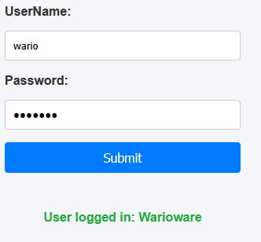

## maak een eigen user

- we maken nu een eigen user erbij:
    ```
    1) bedenk een user name
    2) maak de insert sql (username+display)
    3) gebruik je index en form om je javascript HASH te achterhalen
    4) gebruik de makepassword om de hash (PHP hash) voor in de database te maken
    5) pas je insert aan!
    ```

- HINT: JS hash:
    > 

## TEST

- test je nieuwe user
    > 

## klaar?

- commit & push!