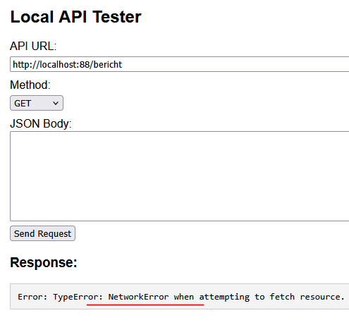

## m6prog_digipost


- we gaan nu verder met m6prog_digipost (uit week 3)

## POST DELETE PUT

- lees:
```
- we moeten nu wat gaan veranderen, we gaan andere method's gebruiken. 
- dat maakt testen lastiger vanwege cross-site-origins
- ook hebben we een tool nodig
```

## tool

- gebruik de locale html file [apitest.html](./tool/apitest.html) om te kijken of je users of berichten op kan halen. 
    > *(Tool is met AI gegenereerd)*
    - als het goed is krijg je een network error
        > 


## CORS toelaten
- ga naar je index.php en voeg dit toe:

    ```php
    // CORS headers
    header("Access-Control-Allow-Origin: *");
    header("Access-Control-Allow-Methods: GET, POST, PUT, DELETE, OPTIONS");
    header("Access-Control-Allow-Headers: Content-Type, Authorization");

    // Handle preflight
    if ($_SERVER['REQUEST_METHOD'] === 'OPTIONS') {
        http_response_code(200);
        exit;
    }
    ```
    - lees:
    > dit zorgt ervoor dat we straks OPTIONS toelaten, en dat we alle ORIGINS accepteren (wat voor een debug/school omgeving nog kan)


## NGINX config

- je NGINX staat standaard best strak dat moeten we aanpassen. open je nginx.conf
    - pas nu de allowed method aan, we voegen wat toen:
        > 

## tool

- gebruik de locale html file [apitest.html](../apitest.html) om te kijken of je users of berichten op kan halen. 
    - dat zou nu moeten werken
    > 


## controlleren

- check met de docent of alles klopt
    
## klaar?

- commit & push!