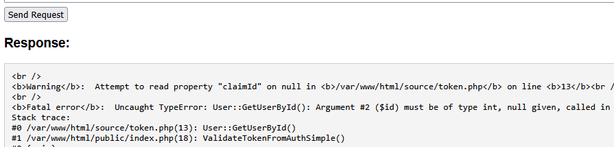
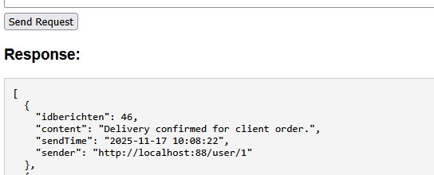

## auth message maken

- lees:
```
- we gaan nu SignClaim aanpassen zodat deze een JWT achtig bericht gaat maken
1) we maken een header 
2) we zetten in de header welke user wij claimed te zijn
3) we maken een signature (hash) van de message met de secret key van de user
    - hiermee 'verifieeren' we dat wij echt die user zijn die we zeggen te zijn
4) we maken een auth message met de signature en header
```

## prep
- zet dit boven aan in signclaim:
    > 


## message
- nu maken we de header :
    > 


## signature

- lees:
    ```
    - we gebruiken hier de nieuwe standaard webcrypto api
    - we veranderen onze header naar een b64 string
    - we maken een signature volgens HMAC
    ```

- nu maken we met de message een b64 string en daarmee maken we een signature:
    > 

- maak van de signature ook een b64 string:
    > 

## auth message

- nu kunnen we de auth message maken en omzetten naar een b64 voor de HTTP header:
    > 

## testen

- test met de juiste auth token voor een user, nu werkt het niet meer!
    > 

## PHP

- we moeten php ook aanpassen! maak een nieuwe function:
    > 
    
- we halen alles uit onze auth header:
    > 

- nu moeten we het volgende doen, lees:
    ```
    1) we halen de claimed user op!
    2) we gebruiken de token van de user uit de database om de signature te verifieeren
    ```
    - we halen eerst de user op:
        > 
    - dan maken we de signature vanuit de database en verifieeren die tegen de meegestuurde:
        > 
    
## testen

- nu werkt het weer:
    > 

## klaar?

- commit & push!