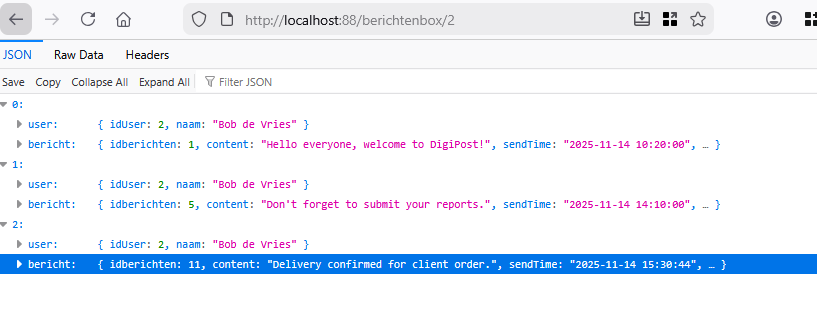

## PUT

- lees:
    ```
        we hebben nu een bericht zonder ontvangers gemaakt. Maar je weet nu hoe het moet
    ```

- bekijk deze test json:

    ```json
    {"content":"Delivery confirmed for client order.","sender":1,
    "receivers":[2,3,4]}
    ```
    - zie je dat we de ontvangers toevoegen?

## user_has_bericht

- open je dataclass de many to many user heeft bericht
    - maak nu een function `InsertUserHasBerichten` om 1 rij te inserten, gebruik je data class
    - maak nu een `FromJson` function, die OOK een bericht meekrijgt
        - uit het bericht halen we het bericht ID
        - deze function geef een array van UserHasBericht objecten terug 
            > 1 voor elke reciever


## controller

- ga naar je bericht controller
    - NA je bericht insert gebruik je de nieuwe function van UserHasBericht om daar alle rijen (uit receivers) te inserten
        - lees het stappenplan:
            ```
            1) je maakt van de json met FromJson op UserHasBerichten een array van UserHasBerichten objecten
            2) je for of foreach loopt over de array
            3) je gebruikt InsertUserHasBerichten om het bericht te inserten
            ```
## testen

- test met de tool en dit bericht:
    ```json
    {"content":"Delivery confirmed for client order.","sender":1,
    "receivers":[2,3,4]}
    ```
- kijk in de berichtenbox van 2, komen daar berichten bij?
    - bekijk het voorbeeld:
        - het was 
            > 
        - daarna komt er 1 bij 
            > 

## LET OP: is deze manier goed?

- lees, belangrijk!
    ```
    Eigenenlijk wil je dit soort inserts, waar je 2 of meer tabellen in 1 keer doet met een transaction doen
    - WANT als er iets fout gaat, is 1 wel goed gelukt en de rest niet
    - Ook is dit niet heel efficient, want je gaat vaak naar de database
    - dit is stap voor stap, eigenlijk moet dit in 1 keer
    - Er is een betere manier, maar die komt later, je kan het wel al zelf proberen uit te zoeken!
    ```
    
## controlleren


- check met de docent of alles klopt

## klaar?

- commit & push!