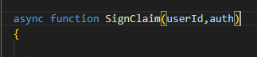

## hash algoritme

- lees:
```
- nu sturen we onze key over de lijn, dat is natuurlijk niet slim

- om dit wat beter te doen moeten we een onderdeel van cryptografie gebruiken:
    - hashing en signing

- we maken van onze boodschap een signature. deze is gemaakt met onze auth key
    - als de signature niet klopt, is deze niet van de echte gebruiker
    - we hashen iets (meestal bytes) naar een string 
        - die string gaan we vergelijken
```


## hash maken in javascript

- lees:
```
we gaan eerst een stukje refactoren! wat we doen is:
1) we maken een function die de authentication header value oplevert (Returned)
2) we gebruiken die function ipv direct de value in sendRequest te maken en gebruiken
```
- zorg dat je gecommit hebt!


 open apitest.html
    - maak een function:
        > 
        
- roep deze aan in sendRequest
    > 

- zorg dat je messageB64 als value voor je Authorisation header gebruikt:
    > 

## test!

- test of alles nog werkt
    - werkt het COMMIT!

- check met de docent of alles klopt


## klaar?

- commit & push!