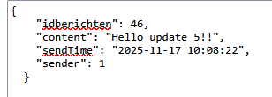

## m6prog_digipost


- we gaan nu verder met m6prog_digipost (uit week 3+6)

## POST DELETE PUT

- lees:
    ```
    - we gaan nu ervoor zorgen dat je een bericht kan updaten
    - we gaan via een POST het bericht opnieuw sturen, maar dan met nieuwe inhoud
    ```

- maak een json bericht aan, dit is om met de tester te sturen
    > 


## PUT?

- ga naar je bericht controller
    - kopieeer je handlePut
    - maak daar een handlePost mee

    
## klaar?

- commit & push!