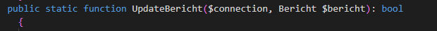

## UPDATE

- open je bericht dataclass

    - maak daar een nieuwe function
        >

- bouw daar het volgende in:
    ```
    - maak een update query voor je bericht tabel
         - vergeet je where niet (id!!)
    - gebruik een prepared statement
    - execute de statement
    - return het result uit de update (dit zou een boolean moeten zijn)
    ```
## controlleren

- check met de docent of alles klopt
    
## klaar?

- commit & push!