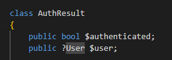

## update!!

- lees:
    ```
    nu kan iedereen een bericht updaten er zit nog geen controle op
    - we willen weten welke user ons iets stuur, dit is uit de token te halen
    - dan controlleren we in de where
    ```

## AuthResult

- open je token.php
    - maak een extra class aan:
        >    
    - maak een goede constructor

## Validate
- verander je ValidateTokenFromAuth function:
    ```
    - zorg dat deze een AuthResult maakt, die not authenticated is
        - in alle FALSE gevallen geef je die terug

    - als de gebruiker validated is, maak je een AuthResult aan welke authenticated is en de user heeft
    ```

## index

- pas je index.php aan:
    ```
    - vang het authresult op en bewaar dat
    - geef die in je bericht controller door aan handlePost
    - en geef de user door aan je UpdateBericht
    - verander je where zo dat deze ook de sender checked met de userid
    ```

## testen

- test door een bericht van een andere user te proberen veranderen
    - voor nu is het prima als het bericht gewoon niet geupdate wordt zonder foutmelding

- je mag ook een 404 gooien!


## controlleren

- check met de docent of alles klopt
    
## klaar?

- commit & push!