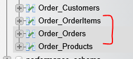
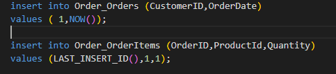
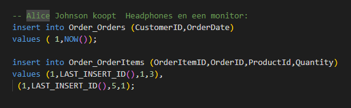
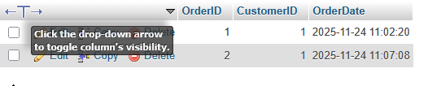
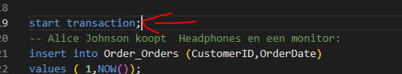
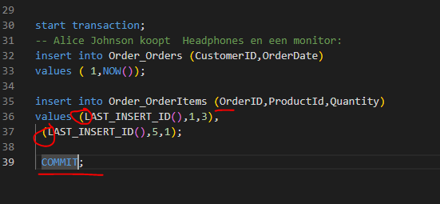

## new project

-  maak een nieuwe docker project:
    - m6prog_transactions

- gebruikt de sql scripts in de sql map om je docker in te richten, gebruik de automatische uitrol

## Order + lines

- bekijk de tabellen:
    >
- lees:
    ```
    als een klant iets bestelt willen wij in beide tabellen iets zetten
    - zouden we dat niet doen, of er gaat iets mis, dan klopt de data niet meer
    ```

- maak nu insert statements (maak een 01_data.sql) die:
    - Alice Johnson koopt een laptop:
        >

- lees:
    ```
    - LAST_INSERT_ID() haalt de id van de order insert op. handig want die had je nodig
    ```

## transaction time

- lees:
    ```
    nu hebben we 2 inserts, maar die gaan nog los af. en als er iets fout gaat hebben we een lege order te pakken
    ```
- maak deze sql na, deze is fout en crashed op de tweede insert
    >
    
- lees:
    ```
    we maken nu zelf de OrderItemID wat niet handig is en maken een dubbele
    - dit kan gebeuren als 2 mensen tegelijk bezig zijn en je de id's zelf doet
    ```
- voer de sql uit, controlleer of je nu een lege order hebt
    >

## aanpassen

- voeg een transaction toe
    >

- test of er nu een lege order bij komt

## ID

- haal de orderitemID weg, zodat de database ze zelf aanmaakt:
    >

- lees:
    ```
    - de commit zorgt ervoor dat de wijzigingen bewaard worden
    - dit is de ctrl-S van de transaction
    ```

- maak een join om te testen
    >


- probeer het nog eens zonder de commit

## controlleren

- check met de docent of alles klopt
    
## klaar?

- commit & push!