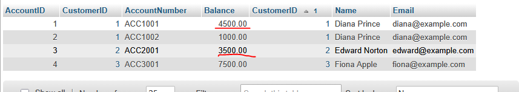
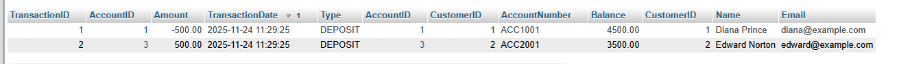

## Bank transfer


- lees:
    ```
    - we gaan nu van rekening 1 naar rekening 2 iets overmaken
        - dit moet natuurlijk altijd in 1 handeling. maar het zijn 2 inserts

    - we gebruiken een transaction om ervoor te zorgen dat als er iets fout gaat het teruggedraaid wordt
    ```

- maak nu zelf SQL om:
    ```
    - van Diana Prince naar Edward Norton 500 over te boeken
    - update de accounts 
    - vergeet niet om de bank_transaction te inserten 
    ```

- maak joins en sla die op om het te controlleren:
    >
    >

    
## klaar?

- commit & push!