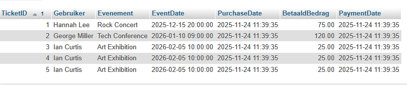

## Tickets kopen

- maak nu SQL voor de volgende scenarios en sla die op:
    ```
    - Scenario 1

    Hannah Lee besluit naar het Rock Concert in de Amsterdam Arena te gaan. Ze koopt één ticket en betaalt €75,00.

    - Scenario 2

    George Miller schrijft zich in voor de Tech Conference in het RAI Convention Center. Hij koopt één ticket en betaalt €120,00.


    - Scenario 3 

    Ian Curtis wil samen met twee vrienden de Art Exhibition in het Van Gogh Museum bezoeken. Hij koopt in één transactie drie tickets en betaalt in totaal €75,00 (3 × €25,00).
    ```
    
## controlleren

- controlleer of je het volgende hebt:
    - schrijf de join zelf!
        > 
## klaar?

- commit & push!