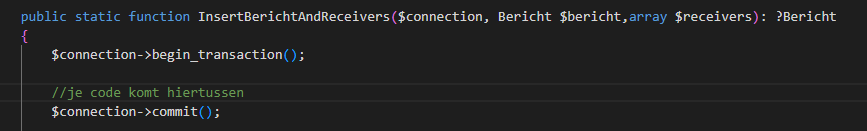
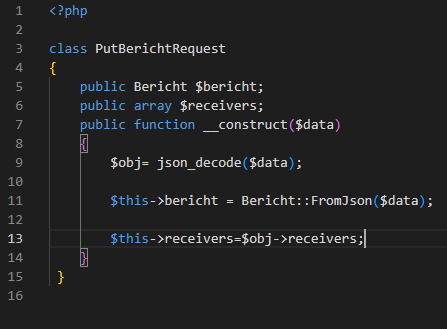
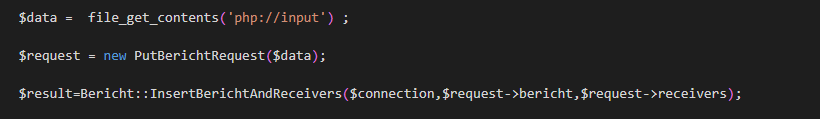
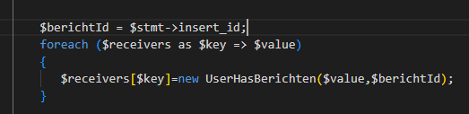
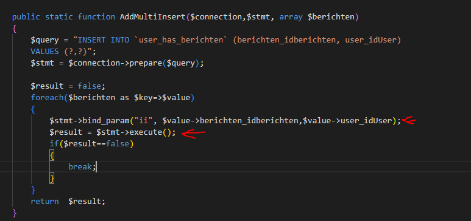
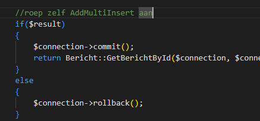

## Digipost

- we gaan nu terug naar ons digipost project, open dat project


## transactie inbouwen

- open je Bericht dataclass
    - maak deze function aan:
        > 


## bericht

- bekijk dit test bericht:
    ```json
    {"content":"test",
    "sender":1,
    "receivers":[2,3,4]
    }
    ```
    - lees:
        ```
        - hier zitten 2 tabellen in verstopt:
            - bericht
            - user_has_bericht
        - receivers is namelijk een userid die bij het bericht wat we inserten gaat horen
        ```

## put request

- maak onder controllers/models een nieuwe class aan:
    > 
    
- in je bericht controller ga naar je HandlePut en vervang de code waar je berichten en userhasberichten maakt door:
    > 
    
- lees:
    ```
    we hebben nu een class gemaakt waar de json op mapped
    - die lezen we in
    - dan geven we het bericht en de recievers int[] door aan Bericht voor verdere afhandeling
    ```

## InsertBerichtAndReceivers

- zet onder de begin_transaction je code uit InsertBericht
    - lees:
        ```
        het idee is om nu EERST een bericht te inserten
        - dan de id op te vragen 
        - dan van de receivers int[] een UserHasBericht[] te maken
        - en die dan in 1 keer te inserten met een multiple prepared statement
        ```
    - onder je ` $stmt->execute` van je bericht insert zet je:
        > 

## Multi

- open je UserHasBericht maak deze function aan:
    > 

- lees:
    ```
    wat gebeurt hier nou?
    - we maken een insert aan
    - dan per rij binden we de parameters en executen we de statement
    - dit alles gebeurt nu binnen de transactie

    - gaat er iets mis? dan stoppen we
    ```

- ga terug naar Bericht::InsertBerichtAndReceivers
    - roep zelf AddMultiInsert aan (lees de functons goed!)
        - daaronder plaats je:
            > 
        
## testen

- test je nieuwe code, als het goed is werkt het
    - en is het net iets netter geregeld zo

- controller bij de docent of het goed is

    
## klaar?

- commit & push!