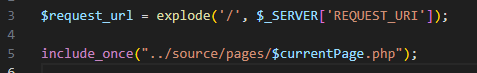
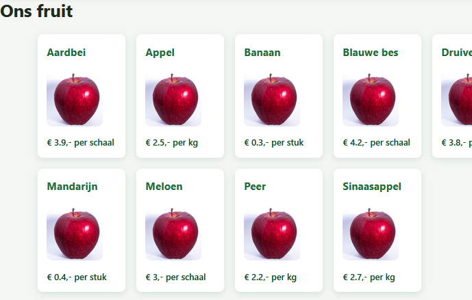

## Database en source

- kijk in je andere projecten en de leerstof:
    - zorg voor een source map met de files die je nodig hebt om deze query uit te voeren:
        - `SELECT 'het werkt' as nice`
    - 
## het werkt

- zorg nu dat je de query hierboven uitvoert en even met een echo op het scherm zet om je database connectie te testen
    >


## opruimen

- werkt je query? dan werkt je database connection. Als dat helemaal in orde is haal je de query en echo's weg

## URL 

- lees:
    ```
    wij willen weer de url in index.php lezen gebruiken voor onze includes van onze pagina's:

    - /groente
    - /contact
    - /fruit
    - /home

    - bekijk het oude project weet je nog hoe dat werkte?
    ```

- pas index.php aan zodat je pagina's include, TEST wel of de url mag/bestaat
    > HINT:   
    > 

## Groente en fruit pagina's

- zorg dat je groente en fruit pagina's werken
    - laat ze ook data tonen (je test data)
    - vergeet niet je JOIN als je die nodig hebt (en dat zou wel moeten)

        > 
    
## controle

- check je werk met de docent

## commit

- commit & push!
