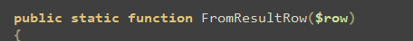
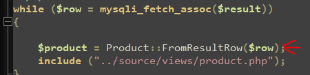

## Static

- open je Product dataclass
    - maak daar een 2 nieuwe functions :
        > 
        > 

- open je fruit pagina, zie je je new Product code? kopieer die!
    - deze moet nu in de FromResultRow function
        - return $product

- terug naar de fruit pagina daar passen we het nu aan naar:
    > 

## REFACTOR
- lees:
    ```
    - wat we nu gedaan hebben is een refactor slag: het aanpassen en verhuizen van code om de code beter te maken

    - onze product maak code staat nu bij product, waar het hoort
    - Nu de database en SQL code nog!
    ```

- ga naar je fruit een kopieer je database code die het $result maakt:
    - het zou er ongeveer zo uit moeten zien:
        > 
    - zet die nu in GetAllProducts in Product
    - nu lezen we het $result en maken er Product's van:
        > 
    
- lees:
    ```
    zie je dat we nu een array van Product's terug geven?
    ```

## Display

- terug naar fruit pas deze zodat we Product::GetALlProducts($connection) gebruiken, ik kreeg dit:
    > 

- dat is niet veel code toch? en super leesbaar!
- doe hetzelfde voor groete
    > HINT: als het goed is is groete ook een product dus is de pagina bijna hetzelfde!

## hetzelfde?

- HMMM het kan nu dat je groete en fruit nu hetzelfde zijn.
    - probeer dat op te lossen in je product dataclasse er zijn meerdere oplossingen mogelijk:
        - geef het product type mee
        - maak een groete/fruit functie
            - als je dit doet, pas ook getall aan ^^

            
## controlleren

- check met de docent je werk
- commit & push!