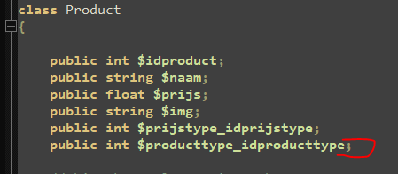
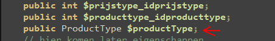

## JOIN

- lees:
    ```
    onze tabellen hebben de foreigh keys als int properties, niet als dataclasses
    - vaak maken frameworks deze koppeling wel
    - wij kiezen nu even om er een property bij te maken en die ook meteen te laden 
    
    ```

## Product uitbreiden 

- als het goed is heeft je product een product type, controlleer of je zoiets hebt:
    > 
- en ook een class ervoor:
    > 
    

- we maken nu in product er een public ProductType productType:
    > 
    - vergeet je include_once niet!

## producttype aanpassen

- nu moeten we ook bij producttype een FromResultRow maken
    > 
    > - en elke andere gejoinde tabel! ik heb er bijvoorbeeld twee!

- als je dat gedaan hebt kan je bij de FromResultRow in Product je andere classes ook loaden:
    > 
    > We kijken of we de data hebben zo ja, laden maar!
    
            
## controlleren

- check met de docent je werk
- commit & push!